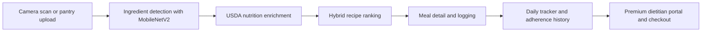

# NutriSync

<div align="center">
  <p>
    <strong>Full-stack pantry scanning, macro-aware meal recommendations, intake tracking, and premium nutrition workflows.</strong>
  </p>
  <p>
    NutriSync turns pantry images into ingredient lists, enriches them with nutrition data, ranks meals against macro goals, and keeps daily progress visible.
  </p>
  <p>
    
    
    
    
    
  </p>
</div>

## Overview

NutriSync combines pantry scanning, USDA nutrition enrichment, hybrid recipe ranking, daily tracking, and a premium dietitian portal in a single application.

## Capabilities

| Pantry to meal | Macro-aware ranking | Daily tracking | Premium upgrade |
| --- | --- | --- | --- |
| Scan via upload or live camera capture from the frontend. | Blend ingredient overlap, macro fit, content similarity, and collaborative filtering. | Log meals, monitor totals, and review 7-day adherence trends. | Route free users and premium signup users through the same checkout flow. |

| Dietitian workflow | USDA enrichment | Performance support | Local-first development |
| --- | --- | --- | --- |
| Premium users unlock trends, averages, nutrition history, and session requests. | Ingredient nutrition is cached with Redis and falls back gracefully when needed. | Real MobileNetV2 scanning is enabled by default for pantry analysis. | One-command scripts run Redis, backend, and frontend together. |

## Experience Flow



## Core Features

- Real pantry scanning with direct camera capture, file upload, and base64 support.
- USDA FoodData Central nutrition enrichment with Redis caching and fallback behavior.
- Hybrid recommender that combines pantry overlap, macro fit, content-based similarity, and collaborative filtering.
- 50 seeded recipes with full ingredients, macros, and step-by-step instructions.
- Daily macro tracker with rings, bars, charts, and meal history.
- Shared upgrade flow for free-user upgrades and premium signup onboarding.
- Premium dietitian portal with averages, trends, history, and session-request handling.
- Responsive React frontend with Framer Motion transitions and mobile-first layouts.

## Tech Stack

| Layer | Tools |
| --- | --- |
| Frontend | React, Vite, TailwindCSS, Axios, Framer Motion, Recharts |
| Backend | FastAPI, Uvicorn, SQLAlchemy, JWT auth |
| ML and data | scikit-learn, pandas, numpy, Pillow, torchvision MobileNetV2, scikit-surprise SVD |
| Database | SQLite for development, PostgreSQL-ready configuration |
| Cache | Redis with 24-hour USDA response caching |
| External data | USDA FoodData Central |

## Quick Start

### One-command startup

After dependencies are installed, start the full stack from the project root:

```bash
./start.sh
```

Stop all managed services:

```bash
./end.sh
```

Logs are written to `.nutrisync/logs/`.

### Manual startup

Backend:

```bash
cd nutrisync-backend
cp .env.example .env
pip install -r requirements.txt
uvicorn main:app --reload
```

Frontend:

```bash
cd nutrisync-frontend
cp .env.example .env
npm install
npm run dev
```

Optional Redis:

```bash
redis-server
```

Frontend runs at `http://localhost:5173` and backend runs at `http://localhost:8000`.

> With `MOCK_CV_MODE=false`, the first real pantry scan may take a little longer while MobileNetV2 weights download locally.

## Test Suite

Backend smoke tests:

```bash
cd nutrisync-backend
pytest tests/test_auth_and_premium_flow.py
```

Frontend interaction tests:

```bash
cd nutrisync-frontend
npm run test
```

The current suite covers seeded-account setup, free-tier access guards, the register-to-upgrade premium flow, and the free-tier Dietitian paywall route.

## Seeded Accounts

Seed data creates exactly 2 seeded users.

| Tier | Email | Password |
| --- | --- | --- |
| Free | `yashmaurya@nutrisync.dev` | `yash123` |
| Premium | `adityatiwari@nutrisync.dev` | `aditya123` |

New registrations are still stored in the database. If a user selects Premium during signup, the account is created first and then routed through the premium checkout flow before premium access is granted.

## Premium Access Flow

1. A free user taps the premium CTA from the Dietitian page, or a new user selects Premium during registration.
2. NutriSync routes them to the shared checkout page.
3. The checkout submits to `POST /auth/upgrade`.
4. The user account is upgraded and the premium Dietitian experience becomes available.

## Environment Variables

Backend defaults live in `nutrisync-backend/.env.example`.

| Variable | Default | Purpose |
| --- | --- | --- |
| `USDA_API_KEY` | `YRboKJAYm057fd1P0Us9beH302V3NEOYkI5bTMKh` | USDA FoodData Central API access |
| `REDIS_URL` | `redis://localhost:6379` | Redis cache connection |
| `DATABASE_URL` | `sqlite:///./nutrisync.db` | Local development database |
| `JWT_SECRET` | `nutrisync_jwt_secret_2024` | JWT signing secret |
| `MOCK_CV_MODE` | `false` | Real image scanning by default |
| `FRONTEND_ORIGIN` | `http://localhost:5173` | CORS allowlist |

Frontend:

| Variable | Default |
| --- | --- |
| `VITE_API_URL` | `http://localhost:8000` |

## API Surface

| Method | Route | Purpose |
| --- | --- | --- |
| `POST` | `/auth/register` | Register a new user |
| `POST` | `/auth/login` | Login and receive JWT |
| `POST` | `/auth/upgrade` | Upgrade a logged-in user to premium |
| `POST` | `/pantry/scan` | Detect pantry ingredients from an image |
| `GET` | `/pantry/ingredients` | Fetch saved pantry ingredients |
| `POST` | `/recipes/recommend` | Return ranked recipe recommendations |
| `GET` | `/recipes/{id}` | Fetch full recipe detail |
| `POST` | `/tracker/log` | Log a meal |
| `GET` | `/tracker/daily` | Get today's totals and goals |
| `GET` | `/tracker/history` | Get recent macro history |
| `GET` | `/dietitian/concierge` | Premium-only dietitian concierge data |
| `POST` | `/dietitian/request-session` | Premium-only session request |
| `GET` | `/dietitian/dashboard` | Premium-only dashboard data |
| `GET` | `/health` | Health check |

## Project Structure

```text
nutrisync-backend/
  main.py
  routes/
  services/
  models/
  data/recipes.json
  requirements.txt

nutrisync-frontend/
  src/
  package.json

start.sh
end.sh
README.md
```

## Development Notes

- `MOCK_CV_MODE=false` enables real image-based ingredient scanning. Set it to `true` only for deterministic fallback detections.
- If the model cannot confidently map the scan to ingredient labels, the pantry API returns a clear validation error so the user can retry with a cleaner image or add ingredients manually.
- If Redis or USDA are unavailable, the app falls back gracefully so local development can continue.
- The backend seeds recipes, the two starter accounts, macro goals, pantry ingredients, and collaborative filtering ratings on startup.

## License

This project is currently maintained as an application repository and does not yet declare a separate license file.
